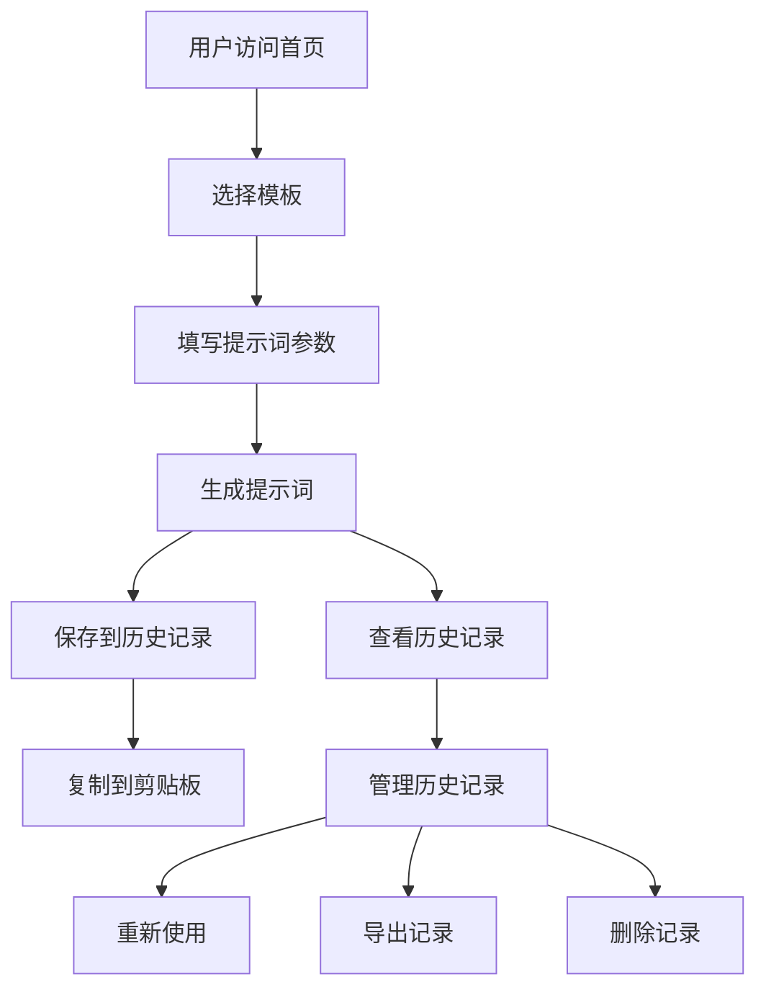

# Code Wiki: PromptGen 项目文档

## 1. 项目概览

PromptGen 是一个专业的 AI 提示词生成工具，旨在帮助用户快速创建高质量的提示词，解锁 AI 工具的全部潜力。

- **直观的用户界面**：提供简洁易用的表单，支持多种参数配置
- **预设模板**：内置 ChatGPT、Midjourney、DALL-E 三种常用 AI 工具的提示词模板
- **历史记录管理**：保存生成的提示词历史，支持复制、重新使用、删除和导出
- **响应式设计**：适配不同屏幕尺寸，提供良好的移动端体验
- **本地存储**：使用浏览器本地存储保存历史记录，无需服务器

## 2. 目录结构

```
├── src/
│   ├── assets/            # 静态资源文件
│   │   └── react.svg      # React 图标
│   ├── components/        # 可复用组件
│   │   ├── Navbar.jsx     # 导航栏组件
│   │   └── PromptGenerator.jsx  # 提示词生成器组件
│   ├── data/              # 数据文件
│   │   └── templates.js   # 预设模板数据
│   ├── hooks/             # 自定义钩子
│   │   └── useLocalStorage.js  # 本地存储钩子
│   ├── pages/             # 页面组件
│   │   ├── Home.jsx       # 首页
│   │   └── History.jsx    # 历史记录页面
│   ├── App.jsx            # 应用主组件
│   ├── index.css          # 全局样式
│   └── main.jsx           # 应用入口
├── .gitignore             # Git 忽略文件
├── README.md              # 项目说明
├── eslint.config.js       # ESLint 配置
├── index.html             # HTML 模板
├── package-lock.json      # 依赖锁定文件
├── package.json           # 项目配置和依赖
├── postcss.config.js      # PostCSS 配置
├── tailwind.config.js     # Tailwind CSS 配置
└── vite.config.js         # Vite 配置
```

## 3. 系统架构与主流程

PromptGen 采用典型的 React 单页应用架构，使用 React Router 进行路由管理，Tailwind CSS 进行样式设计。整体架构简洁明了，分为以下几个核心部分：

1. **路由层**：由 App.jsx 中的 React Router 管理，包含首页和历史记录两个主要路由
2. **页面层**：包含 Home 和 History 两个页面组件
3. **组件层**：包含 Navbar 和 PromptGenerator 等可复用组件
4. **数据层**：包含预设模板数据和本地存储的历史记录
5. **工具层**：包含自定义钩子如 useLocalStorage

### 主要数据流



## 4. 核心功能模块

### 4.1 提示词生成器（PromptGenerator）

**功能**：核心功能模块，负责提示词的生成、参数配置和历史记录保存。

**主要功能点**：
- 模板选择：提供 ChatGPT、Midjourney、DALL-E 三种预设模板
- 参数配置：支持主题、风格、长度、语气和额外要求等参数设置
- 提示词生成：根据用户输入的参数生成标准化的提示词
- 历史记录：自动保存生成的提示词到本地存储
- 复制功能：支持将生成的提示词复制到剪贴板

**关键代码**：[PromptGenerator.jsx](file:///workspace/src/components/PromptGenerator.jsx)

### 4.2 历史记录管理（History）

**功能**：管理用户生成的提示词历史，支持查看、复制、重新使用、删除和导出。

**主要功能点**：
- 历史记录展示：按时间顺序展示生成的提示词
- 批量操作：支持选择多条记录进行批量导出
- 单条操作：支持复制、重新使用和删除单条记录
- 导出功能：支持以 TXT 和 JSON 格式导出历史记录
- 时间格式化：智能显示时间，如"今天"、"昨天"等

**关键代码**：[History.jsx](file:///workspace/src/pages/History.jsx)

### 4.3 导航栏（Navbar）

**功能**：提供应用导航，支持响应式设计。

**主要功能点**：
- 品牌标识：显示应用名称和图标
- 导航链接：提供首页和历史记录的导航
- 响应式设计：在移动设备上显示汉堡菜单
- 滚动效果：滚动时导航栏样式变化

**关键代码**：[Navbar.jsx](file:///workspace/src/components/Navbar.jsx)

### 4.4 本地存储（useLocalStorage）

**功能**：自定义钩子，用于在本地存储中持久化数据。

**主要功能点**：
- 数据读取：从本地存储中读取数据
- 数据写入：将数据写入本地存储
- 错误处理：处理可能的存储错误
- 类型转换：自动处理 JSON 序列化和反序列化

**关键代码**：[useLocalStorage.js](file:///workspace/src/hooks/useLocalStorage.js)

## 5. 核心 API/类/函数

### 5.1 PromptGenerator 组件

**功能**：生成 AI 提示词的核心组件

**主要方法**：
- `handleInputChange(e)`：处理表单输入变化
- `handleTemplateSelect(template)`：处理模板选择
- `generatePrompt()`：生成提示词
- `saveToHistory()`：保存生成的提示词到历史记录
- `copyToClipboard()`：复制提示词到剪贴板

**参数**：无

**返回值**：React 组件

**关键代码**：[PromptGenerator.jsx](file:///workspace/src/components/PromptGenerator.jsx)

### 5.2 History 组件

**功能**：管理和展示提示词历史记录

**主要方法**：
- `formatDate(timestamp)`：格式化时间显示
- `copyToClipboard(id, text)`：复制提示词到剪贴板
- `reusePrompt(item)`：重新使用历史记录中的提示词
- `deleteHistoryItem(id)`：删除历史记录项
- `toggleSelectItem(id)`：切换记录选择状态
- `selectAll()`：全选记录
- `deselectAll()`：取消全选
- `generateTxtContent(items)`：生成 TXT 格式的导出内容
- `exportSingleItem(item, format)`：导出单个记录
- `exportSelectedItems(format)`：导出选中的记录
- `exportAllItems(format)`：导出所有记录
- `confirmExport()`：确认导出操作

**参数**：无

**返回值**：React 组件

**关键代码**：[History.jsx](file:///workspace/src/pages/History.jsx)

### 5.3 Navbar 组件

**功能**：提供应用导航

**主要方法**：
- `isActive(path)`：判断当前路径是否激活

**参数**：无

**返回值**：React 组件

**关键代码**：[Navbar.jsx](file:///workspace/src/components/Navbar.jsx)

### 5.4 useLocalStorage 钩子

**功能**：在本地存储中持久化数据

**参数**：
- `key`：存储键名
- `initialValue`：初始值

**返回值**：[storedValue, setValue] - 存储的值和更新值的函数

**关键代码**：[useLocalStorage.js](file:///workspace/src/hooks/useLocalStorage.js)

### 5.5 templates 数据

**功能**：提供预设的提示词模板

**结构**：包含 id、name、description、icon 和 defaultValues 字段的对象数组

**关键代码**：[templates.js](file:///workspace/src/data/templates.js)

## 6. 技术栈与依赖

| 技术/依赖 | 版本 | 用途 | 来源 |
|---------|------|------|------|
| React | ^19.0.0 | 前端框架 | [package.json](file:///workspace/package.json) |
| React DOM | ^19.0.0 | React DOM 操作 | [package.json](file:///workspace/package.json) |
| React Router DOM | ^7.14.0 | 路由管理 | [package.json](file:///workspace/package.json) |
| Tailwind CSS | ^4.2.2 | 样式框架 | [package.json](file:///workspace/package.json) |
| Vite | ^6.0.11 | 构建工具 | [package.json](file:///workspace/package.json) |
| ESLint | ^9.21.0 | 代码质量检查 | [package.json](file:///workspace/package.json) |

## 7. 关键模块与典型用例

### 7.1 生成提示词

**功能说明**：用户可以通过填写表单生成 AI 提示词

**配置与依赖**：
- 依赖：React、useLocalStorage 钩子
- 配置：无特殊配置

**使用流程**：
1. 访问首页
2. 选择预设模板（可选）
3. 填写主题内容
4. 选择风格、长度、语气
5. 添加额外要求（可选）
6. 点击"生成提示词"按钮
7. 复制生成的提示词

**示例**：
```javascript
// 生成提示词的核心逻辑
const generatePrompt = () => {
  if (!formData.topic.trim()) {
    setShowError(true)
    setTimeout(() => {
      setShowError(false)
    }, 3000)
    return
  }

  let prompt = ''

  prompt += `请根据以下要求生成内容：\n\n`
  prompt += `主题/内容：${formData.topic}\n\n`
  prompt += `风格要求：${styleOptions.find(s => s.value === formData.style)?.label}\n`
  prompt += `内容长度：${lengthOptions.find(l => l.value === formData.length)?.label}\n`
  prompt += `语气要求：${toneOptions.find(t => t.value === formData.tone)?.label}\n\n`

  if (formData.additionalInstructions.trim()) {
    prompt += `额外要求：${formData.additionalInstructions}\n\n`
  }

  prompt += `请按照以上要求，精心创作优质内容。`

  setGeneratedPrompt(prompt)
  setTimeout(() => {
    saveToHistory()
  }, 0)
}
```

### 7.2 管理历史记录

**功能说明**：用户可以查看、复制、重新使用、删除和导出历史记录

**配置与依赖**：
- 依赖：React、useLocalStorage 钩子、React Router
- 配置：无特殊配置

**使用流程**：
1. 访问历史记录页面
2. 查看生成的提示词历史
3. 复制提示词到剪贴板
4. 点击"重新使用"按钮返回首页并填充表单
5. 删除不需要的记录
6. 选择记录并导出为 TXT 或 JSON 格式

**示例**：
```javascript
// 导出历史记录的核心逻辑
const confirmExport = () => {
  let content, filename, mimeType
  
  if (exportFormat === 'txt') {
    content = generateTxtContent(exportItems)
    filename = `prompt-history-${Date.now()}.txt`
    mimeType = 'text/plain;charset=utf-8'
  } else {
    content = JSON.stringify(exportItems, null, 2)
    filename = `prompt-history-${Date.now()}.json`
    mimeType = 'application/json;charset=utf-8'
  }

  const blob = new Blob([content], { type: mimeType })
  const url = URL.createObjectURL(blob)
  const link = document.createElement('a')
  link.href = url
  link.download = filename
  document.body.appendChild(link)
  link.click()
  document.body.removeChild(link)
  URL.revokeObjectURL(url)
  
  setShowExportDialog(false)
  setExportItems([])
  showToast(`成功导出 ${exportItems.length} 条记录！`, 'success')
}
```

## 8. 配置、部署与开发

### 8.1 开发环境设置

1. **安装依赖**：
   ```bash
   npm install
   ```

2. **启动开发服务器**：
   ```bash
   npm run dev
   ```

3. **构建生产版本**：
   ```bash
   npm run build
   ```

4. **预览生产构建**：
   ```bash
   npm run preview
   ```

5. **代码质量检查**：
   ```bash
   npm run lint
   ```

### 8.2 部署

由于这是一个纯前端应用，可以部署到任何静态网站托管服务，如：
- Vercel
- Netlify
- GitHub Pages
- AWS S3 + CloudFront

部署流程：
1. 运行 `npm run build` 生成生产构建
2. 将 `dist` 目录上传到托管服务

## 9. 监控与维护

### 9.1 错误处理

- **本地存储错误**：useLocalStorage 钩子包含错误处理，当本地存储操作失败时会记录错误并返回初始值
- **复制操作错误**：复制到剪贴板操作包含 try-catch 处理，失败时会在控制台记录错误

### 9.2 性能优化

- **组件拆分**：将应用拆分为多个小型组件，提高可维护性和性能
- **状态管理**：使用 React useState 进行本地状态管理，避免不必要的全局状态
- **响应式设计**：使用 Tailwind CSS 的响应式类，确保在不同设备上的良好体验

## 10. 总结与亮点回顾

PromptGen 是一个功能完整、用户友好的 AI 提示词生成工具，具有以下亮点：

1. **直观的用户界面**：简洁明了的表单设计，使用户可以轻松生成高质量的提示词
2. **预设模板**：内置常用 AI 工具的提示词模板，为用户提供参考
3. **历史记录管理**：完整的历史记录功能，支持复制、重新使用、删除和导出
4. **本地存储**：使用浏览器本地存储保存历史记录，无需服务器，保证数据隐私
5. **响应式设计**：适配不同屏幕尺寸，提供良好的移动端体验
6. **现代化技术栈**：使用 React 19、Tailwind CSS 4 等最新技术
7. **代码质量**：清晰的代码结构和良好的组件组织，便于维护和扩展

PromptGen 为用户提供了一个简单而强大的工具，帮助他们充分发挥 AI 工具的潜力，生成更加精准和有效的提示词。